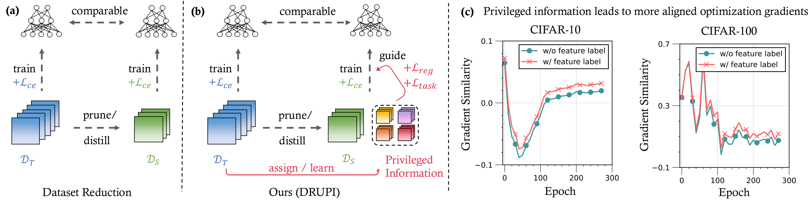
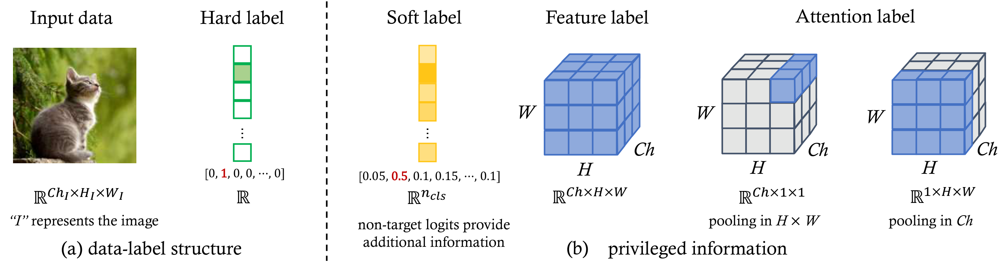
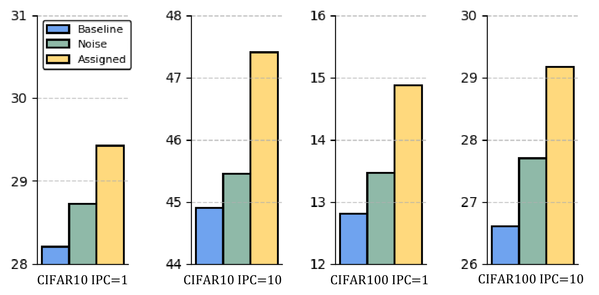
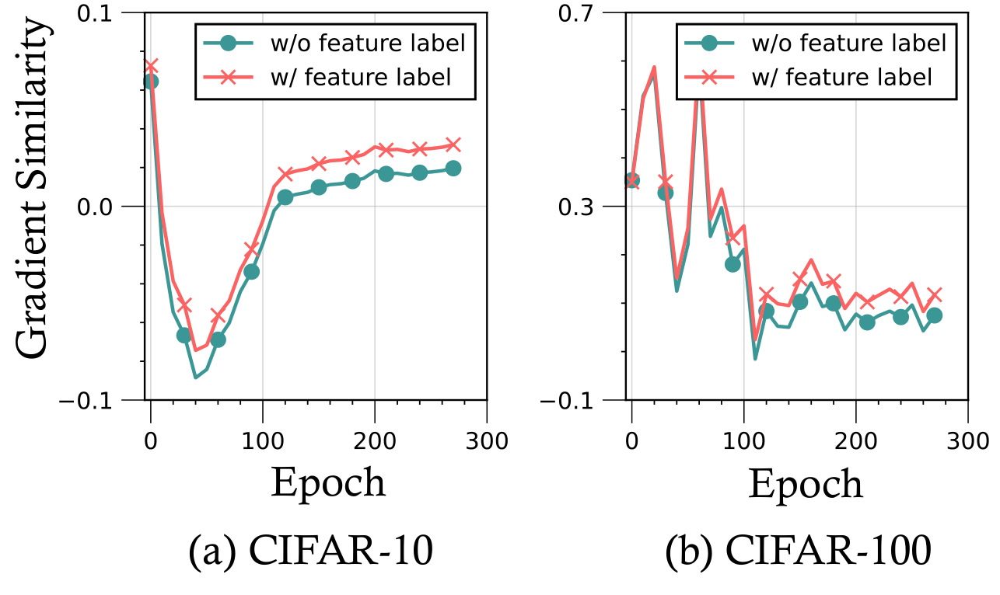
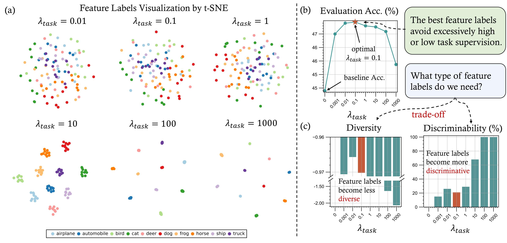
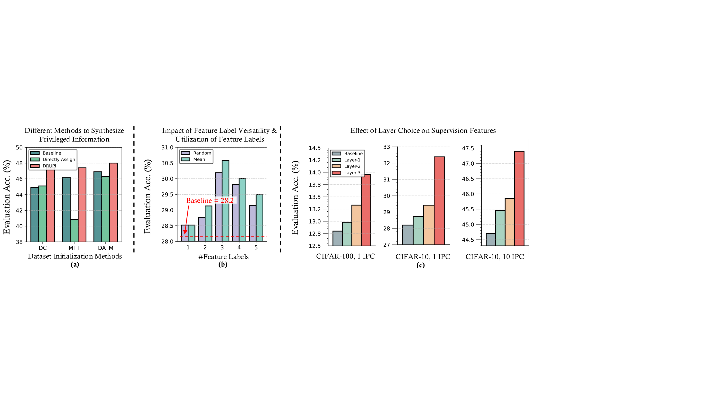

<div align="center">

# Refraction

### Dataset Reduction Using Privileged Information (DRUPI)

A modular reimplementation of **RDED** (Realistic Dataset Evaluation and Distillation) with **DRUPI** — a framework that enriches reduced datasets with privileged teacher knowledge for better student training.

[](https://www.python.org/)
[](https://pytorch.org/)

[Overview](#overview) &bull; [Method](#method) &bull; [Installation](#installation) &bull; [Quick Start](#quick-start) &bull; [Usage](#usage) &bull; [Results](#results) &bull; [Citation](#citation)

</div>

---

## Overview

Dataset distillation aims to compress a large training set into a small synthetic one while preserving downstream model performance. Most existing methods store only **images + hard labels**, discarding the rich intermediate knowledge a teacher model holds.

**DRUPI** addresses this by attaching **privileged information** — teacher-extracted feature labels — to each synthetic sample. During student training, these feature labels provide two additional supervision signals that significantly improve convergence and final accuracy, especially in extreme low-IPC regimes.

<div align="center">


**(a)** Standard dataset reduction stores only images and class labels.
**(b)** DRUPI additionally assigns teacher feature labels as privileged information, introducing *L*<sub>reg</sub> and *L*<sub>task</sub> losses.
**(c)** Privileged information leads to more aligned optimization gradients between synthetic and real data.
</div>

## Method

### What is Privileged Information?

In the context of dataset distillation, **privileged information** refers to auxiliary labels that go beyond one-hot class labels. The teacher model's internal representations — captured as **feature labels** — encode richer structural information about each sample.

<div align="center">


From left to right: input data with hard labels, soft labels (logits), **feature labels** (penultimate-layer activations), and attention labels. DRUPI focuses on feature labels as privileged information.
</div>

### Training Objective

The student is trained with a combined loss:

$$\mathcal{L} = \mathcal{L}_{\text{KL}} + \lambda_{\text{reg}} \cdot \mathcal{L}_{\text{reg}} + \lambda_{\text{task}} \cdot \mathcal{L}_{\text{task}}$$

where:

| Loss | Formula | Role |
|------|---------|------|
| $\mathcal{L}_{\text{KL}}$ | $\text{KL}\bigl(\sigma(z_s / \tau) \;\|\; \sigma(z_t / \tau)\bigr)$ | Standard KL distillation on augmented images |
| $\mathcal{L}_{\text{reg}}$ | $\text{MSE}(f_s,\; f^*)$ | Align student features with teacher feature labels |
| $\mathcal{L}_{\text{task}}$ | $\text{CE}(y,\; \kappa(f^*;\, \theta_s))$ | Ensure feature labels are task-relevant via student classifier |

- $f^*$: pre-computed teacher feature labels (privileged information)
- $f_s$: student penultimate-layer features
- $\kappa(\cdot;\, \theta_s)$: student's classifier head

### Pipeline

```
┌─────────────────────────────────────────────────────────────────┐
│                        SYNTHESIS PHASE                          │
│                                                                 │
│  Real Dataset ──→ Random Crop ──→ Teacher Selection ──→ Mix     │
│                    (patches)      (top-k by CE loss)   (grid)   │
│                                                                 │
│  Mixed Images ──→ Save as JPEG                                  │
│               └─→ Teacher Forward ──→ Save feat_labels.pt       │
│                   (penultimate layer)    (privileged info)       │
└─────────────────────────────────────────────────────────────────┘
                              ↓
┌─────────────────────────────────────────────────────────────────┐
│                      DISTILLATION PHASE                         │
│                                                                 │
│  Synthetic Data ──→ CutMix/Mixup ──→ Teacher (frozen)          │
│  + feat_labels           │                  │                   │
│       │                  │            soft targets (L_KL)       │
│       │                  └──→ Student ──────┘                   │
│       │                        │                                │
│       ├── MSE(f_s, f*)  ──→  L_reg                              │
│       └── CE(y, κ(f*))  ──→  L_task                             │
│                                                                 │
│  Total Loss = L_KL + λ_reg · L_reg + λ_task · L_task           │
└─────────────────────────────────────────────────────────────────┘
```

## Installation

### Requirements

- Python >= 3.10
- PyTorch >= 2.0
- torchvision
- tqdm, numpy, Pillow

Optional (for auto-downloading pretrained models):
```bash
pip install gdown
```

### Setup

```bash
git clone https://github.com/<your-username>/refraction.git
cd refraction
```

No `pip install` needed — run directly from the project root.

## Quick Start

### CIFAR-10 with ConvNet-3 (fastest)

```bash
# Full experiment: synthesis + distillation
python cli.py full-run \
  --subset cifar10 \
  --arch-name conv3 \
  --stud-name conv3 \
  --ipc 10 --mipc 300 --factor 1 --num-crop 5

# With DRUPI privileged information
python cli.py full-run \
  --subset cifar10 \
  --arch-name conv3 \
  --stud-name conv3 \
  --ipc 10 --mipc 300 --factor 1 --num-crop 5 \
  --use-feat-labels --lambda-reg 0.5 --lambda-task 0.1
```

Datasets (CIFAR-10/100, TinyImageNet) and pretrained models are **auto-downloaded** on first run.

### Python API

```python
from config import ExperimentConfig, finalize_config
from synthesis import run_synthesis
from distill import run_distillation

cfg = ExperimentConfig(
    subset="cifar10",
    arch_name="conv3",
    stud_name="conv3",
    ipc=10, mipc=300, factor=1, num_crop=5,
    use_feat_labels=True,
    lambda_reg=0.5,
    lambda_task=0.1,
)
cfg = finalize_config(cfg)

run_synthesis(cfg)
result = run_distillation(cfg)
print(f"Best Acc: {result.best_acc1:.2f}% @ epoch {result.best_epoch}")
```

## Usage

### CLI Commands

| Command | Description |
|---------|-------------|
| `python cli.py full-run [args]` | Run synthesis followed by distillation |
| `python cli.py synthesize [args]` | Run only the synthesis phase |
| `python cli.py distill [args]` | Run only the distillation phase |
| `python cli.py prepare --subset <name>` | Download and prepare a dataset |

### Key Arguments

#### Dataset & Paths

| Argument | Default | Description |
|----------|---------|-------------|
| `--subset` | `imagenet-1k` | Dataset name |
| `--data-root` | `./data` | Root directory for all datasets and models |
| `--exp-root` | `./exp` | Root directory for experiment outputs |

#### Model Architecture

| Argument | Default | Description |
|----------|---------|-------------|
| `--arch-name` | `resnet18` | Teacher model architecture |
| `--stud-name` | `resnet18` | Student model architecture |

#### Synthesis

| Argument | Default | Description |
|----------|---------|-------------|
| `--ipc` | `50` | Images per class in synthetic dataset |
| `--mipc` | `600` | Candidate images per class (before selection) |
| `--factor` | `2` | Grid factor for patch mixing (factor x factor) |
| `--num-crop` | `1` | Number of random crops per candidate |

#### DRUPI (Privileged Information)

| Argument | Default | Description |
|----------|---------|-------------|
| `--use-feat-labels` | `false` | Enable privileged information |
| `--lambda-reg` | `0.5` | Weight for feature regression loss $\mathcal{L}_{\text{reg}}$ |
| `--lambda-task` | `0.1` | Weight for task-oriented loss $\mathcal{L}_{\text{task}}$ |

#### Distillation

| Argument | Default | Description |
|----------|---------|-------------|
| `--mix-type` | `cutmix` | Augmentation type (`cutmix` / `mixup`) |
| `--re-epochs` | `300` | Training epochs |
| `--cos` / `--no-cos` | `--cos` | Cosine annealing LR schedule |
| `--sgd` | `false` | Use SGD instead of AdamW |

### Supported Datasets

| Dataset | `--subset` | Classes | Auto-Download |
|---------|------------|---------|:---:|
| CIFAR-10 | `cifar10` | 10 | Yes |
| CIFAR-100 | `cifar100` | 100 | Yes |
| TinyImageNet | `tinyimagenet` | 200 | Yes |
| ImageNet-Nette | `imagenet-nette` | 10 | No |
| ImageNet-Woof | `imagenet-woof` | 10 | No |
| ImageNet-100 | `imagenet-100` | 100 | No |
| ImageNet-1K | `imagenet-1k` | 1000 | No |

### Supported Models

| Model | `--arch-name` / `--stud-name` | Available Pretrained |
|-------|-------------------------------|---------------------|
| ConvNet-3 | `conv3` | CIFAR-10, CIFAR-100 |
| ConvNet-4 | `conv4` | TinyImageNet, ImageNet-1K |
| ConvNet-5 | `conv5` | ImageNet-Nette/Woof, ImageNet-10 |
| ConvNet-6 | `conv6` | ImageNet-100 |
| ResNet-18 (modified) | `resnet18_modified` | CIFAR-10/100, TinyImageNet |
| ResNet-18 | `resnet18` | ImageNet-Nette/Woof/10/100 |
| ResNet-101 (modified) | `resnet101_modified` | — |

> **Note:** "modified" variants use 3x3 conv1 and no maxpool, suited for small-resolution datasets (CIFAR, TinyImageNet).

### Example Configurations

<details>
<summary><b>CIFAR-10, ConvNet-3, IPC=1 (extreme compression)</b></summary>

```bash
python cli.py full-run \
  --subset cifar10 --arch-name conv3 --stud-name conv3 \
  --ipc 1 --mipc 300 --factor 1 --num-crop 5 \
  --use-feat-labels --lambda-reg 0.5 --lambda-task 0.1
```
</details>

<details>
<summary><b>CIFAR-100, ResNet-18-Modified, IPC=10</b></summary>

```bash
python cli.py full-run \
  --subset cifar100 --arch-name resnet18_modified --stud-name resnet18_modified \
  --ipc 10 --mipc 600 --factor 2 --num-crop 1 \
  --use-feat-labels --lambda-reg 0.5 --lambda-task 0.1
```
</details>

<details>
<summary><b>TinyImageNet, ConvNet-4, IPC=50</b></summary>

```bash
python cli.py full-run \
  --subset tinyimagenet --arch-name conv4 --stud-name conv4 \
  --ipc 50 --mipc 600 --factor 2 --num-crop 1
```
</details>

<details>
<summary><b>Download dataset and model only (no training)</b></summary>

```bash
python cli.py prepare --subset cifar10 --data-root ./data --model conv3
```
</details>

## Results

### Feature Labels Improve Initialization

Directly assigning teacher features as privileged information consistently outperforms both the baseline (no feature labels) and random noise initialization across all IPC settings.

<div align="center">

</div>

### Gradient Alignment

Feature labels guide the student to maintain higher gradient similarity with respect to the real training objective throughout training, leading to better generalization.

<div align="center">

</div>

### Feature Label Analysis

The $\lambda_{\text{task}}$ hyperparameter controls the trade-off between **diversity** and **discriminability** of feature labels. Moderate values (e.g., 0.1) yield the best evaluation accuracy.

<div align="center">

</div>

### Ablation Studies

<div align="center">


**(a)** DRUPI is compatible with different dataset initialization methods (DC, MTT, DATM).
**(b)** More feature labels per sample improve performance; directly assigning is better than learning.
**(c)** Penultimate-layer features (Layer 3) provide the best supervision signal.
</div>

## Project Structure

```
refraction/
├── cli.py                 # CLI entry point (synthesize / distill / full-run / prepare)
├── __main__.py            # python -m refraction support
├── config.py              # ExperimentConfig dataclass and argument parsing
├── augmentation.py        # CutMix, Mixup, normalize, MultiRandomCrop
├── data/
│   ├── datasets.py        # ImageFolder, DataLoader builders
│   └── download.py        # Auto-download (CIFAR, TinyImageNet, pretrained models)
├── models/
│   ├── convnet.py         # ConvNet-{3,4,5,6} backbone
│   └── factory.py         # Model creation, pretrained loading, feature API wrapper
├── synthesis/
│   └── pipeline.py        # Patch selection, mixing, image + feature label saving
├── distill/
│   └── trainer.py         # KL distillation + DRUPI privileged losses
└── utils/
    ├── metrics.py          # AverageMeter, accuracy
    └── optim.py            # Parameter grouping for weight decay
```

## Citation

```bibtex
@article{sun2024drupi,
  title={Dataset Reduction using Privileged Information},
  author={Sun, Shaobo and Li, Yantai and Zhang, Shuai and Niu, Tianle and others},
  journal={arXiv preprint arXiv:2410.01611},
  year={2024}
}
```

## License

This project is for academic research purposes.
